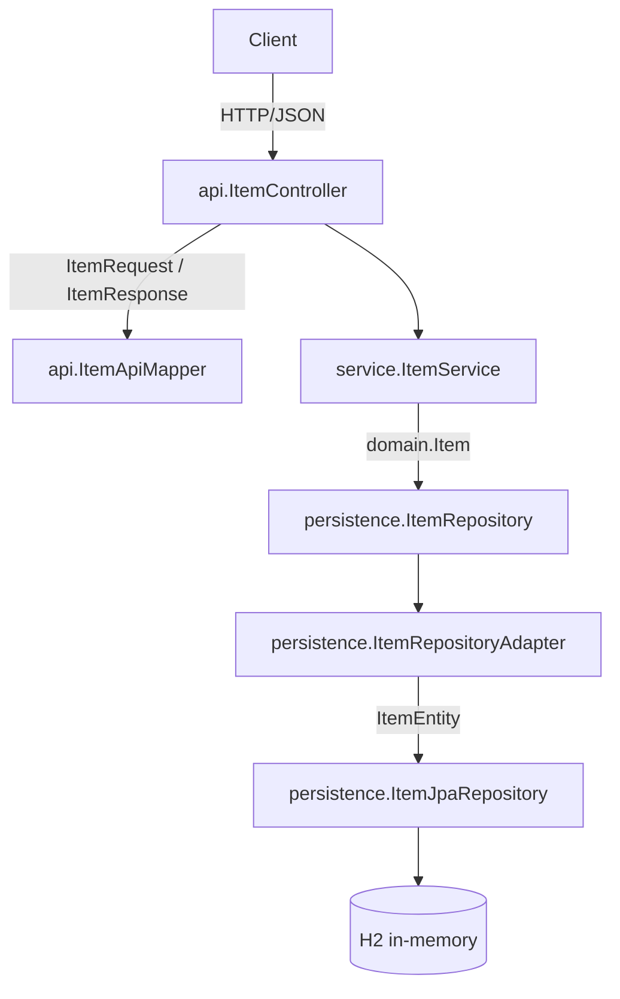

# Architecture

The service is a layered Spring Boot application. A request enters at the controller, which
speaks DTOs, and travels down through the service, which speaks the domain type, to a
repository adapter, which speaks JPA entities. Each layer depends only on the layer below it.

## Layers

- `api/` holds the REST controller, the transport DTOs, and the mapper between DTOs and the domain. It carries the springdoc annotations, so the OpenAPI document is generated from this code.
- `service/` holds the business logic. It works in `domain.Item` and depends on the `persistence.ItemRepository` port, not on JPA.
- `domain/` holds `Item`, the type the service reasons about. It has no framework imports.
- `persistence/` holds the JPA entity, the Spring Data repository, the domain-facing port, and the adapter that implements the port over JPA.
- `config/` holds the springdoc `OpenAPI` bean and the development seed.
- `exception/` holds `ItemNotFoundException` and the `@RestControllerAdvice` that maps it to an HTTP 404 problem detail.

## Containment

The controller never sees a JPA entity and the service never sees a DTO. The adapter is the only
place that converts between `ItemEntity` and `Item`, and the mapper is the only place that
converts between `Item` and the DTOs. That keeps the framework out of the domain and business logic.
